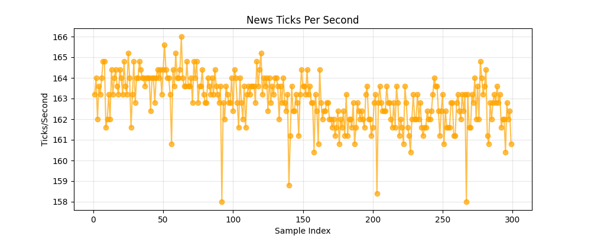
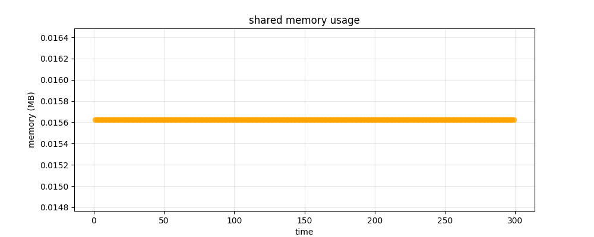
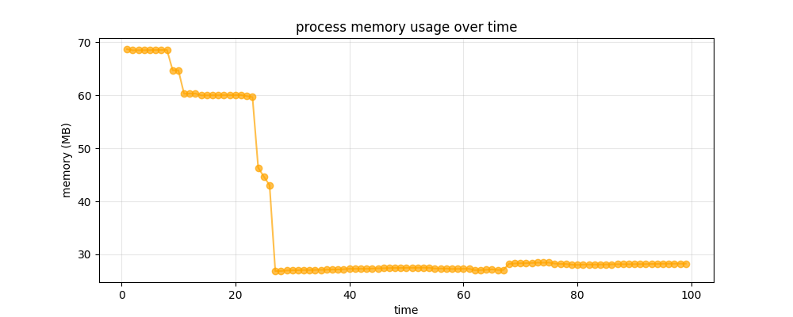

# Performance Report - Assignment 8

## Executive Summary

Overview of trading system performance for AAPL, SPY, and MSFT with focus on latency, throughput, and memory metrics. Without loss of generality, comparison is on a 300 tick sample. 

---

## 1. Latency Analysis

### Latency

Processing and decision latency across AAPL, SPY, and MSFT.

* No significant difference between batches of symbols.

### AAPL Latency Performance

* Mean Processing Latency and Mean Decision Latency are very similar with mean of 12.35ms. Given that most of the latency is clustered around this mean, there seem to be no systematic issue in the process.

* No pattern has been found on latency over time. This further confirms delay is not affected by running time of the system. 

---

## 2. Throughput Analysis

Througput of News information is around 162-165 ticks/second. The system is producing very stable throughput.

---

## 3. Memory Usage

### Shared Memory

**Why is Shared Memory Constant at 0.015625 MB (16 KB)?**

Shared memory is pre-allocated with fixed size for predictable performance:
- Fixed-size memory-mapped files for deterministic behavior
- Virtual address space reservation (not physical memory)
- Shared across all components for efficient IPC
- No dynamic growth to prevent fragmentation

### Process Memory

The strategy process demonstrates stable and safe memory behavior with no evidence of leaks.

Memory usage drops significantly after initialization as temporary objects and buffers are released (68 MB to 27MB)), then remains extremely stable throughout the rest of the execution.

