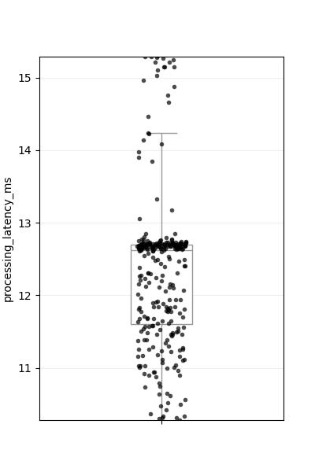
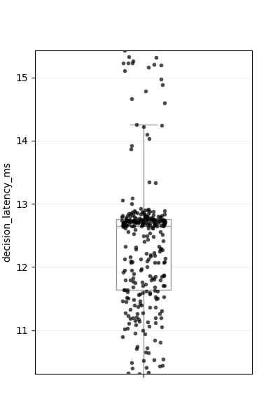
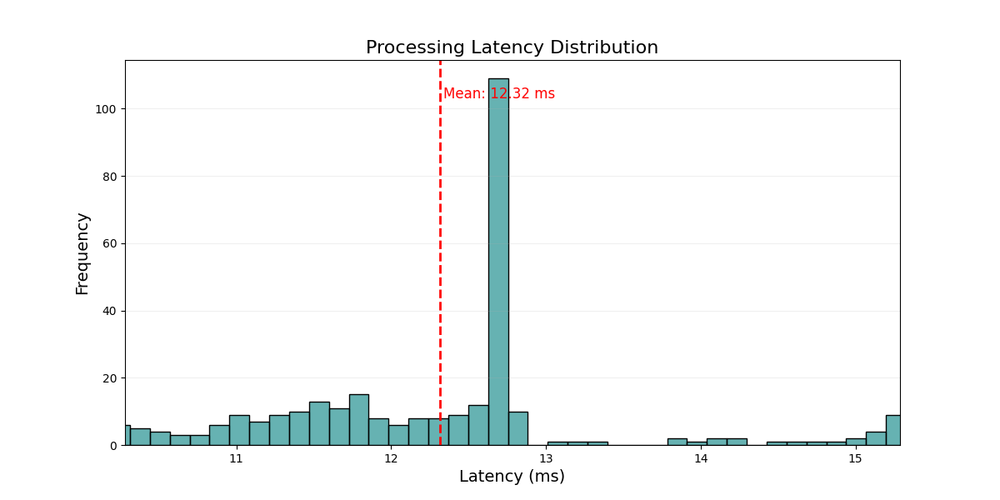
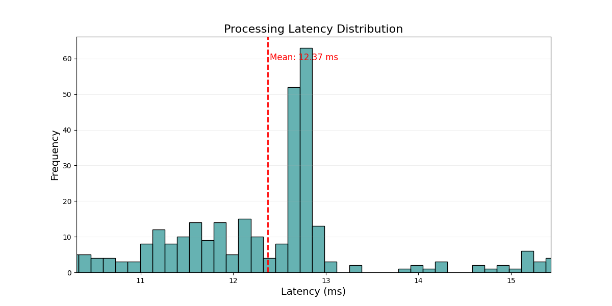
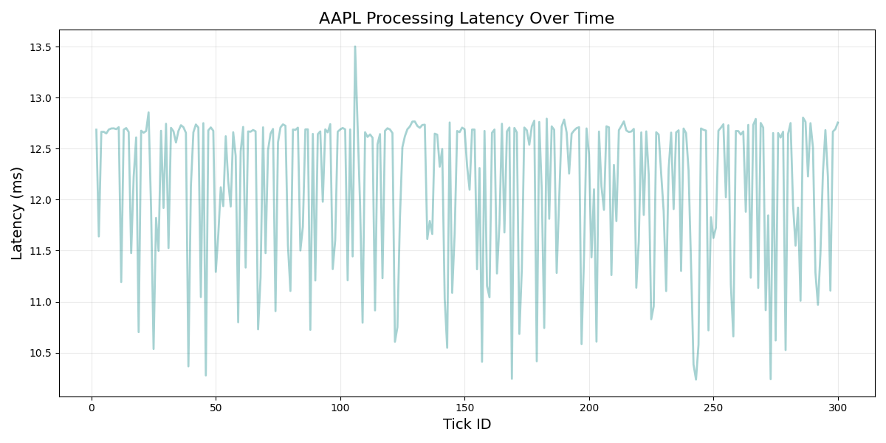

# Performance Report - Assignment 8

## Executive Summary

Overview of trading system performance for AAPL, SPY, and MSFT with focus on latency, throughput, and memory metrics. Without loss of generality, comparison is on a 300 tick sample. 

---

## 1. Latency Analysis

### Latency

Processing and decision latency across AAPL, SPY, and MSFT.

* No significant difference between batches of symbols.

### AAPL Latency Performance

* Mean Processing Latency and Mean Decision Latency are very similar with mean of 12.35ms. Given that most of the latency is clustered around this mean, there seem to be no systematic issue in the process.

* No pattern has been found on latency over time. This further confirms delay is not affected by running time of the system. 

---

## 2. Throughput Analysis

Mean Througput of price information and that of News information are roughly the same at 157.3 Ticks/second.

---

## 3. Memory Usage

### Shared Memory

**Why is Shared Memory Constant at 0.015625 MB (16 KB)?**

Shared memory is pre-allocated with fixed size for predictable performance:
- Fixed-size memory-mapped files for deterministic behavior
- Virtual address space reservation (not physical memory)
- Shared across all components for efficient IPC
- No dynamic growth to prevent fragmentation

### Process Memory

* Orderbook class is continuously consuming the highest memory. This is expected as orderbook
1. is influenced by server connection overhead
2. contains huge data parsing logic for each input msg
3. logs more frequently to keep tick level data

* Price strategy shows more data consumption than News strategy because
1. Prices strategy keeps historical data information for moving average calculation.

